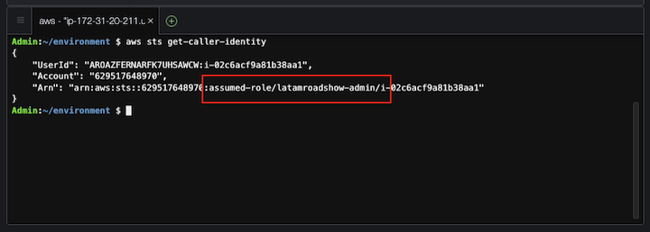

# LATAM Containers Roadshow - ECS Workshop

[**< Back**](./README.md)

## Chapter 1 - Prepare the Working Environment

Before we dive into the AWS Copilot commands and Amazon ECS constructs, we need to prepare our working environment. This workshops provides an Amazon CloudFormation stack (available at `helpers/cloudformation-cloud9-template.yaml`) that creates an AWS Cloud9 environment and installs all the required tooling required for the exercices. However, we still need to make a minor change:

1. Access your AWS account, and use the search bar to access and open the AWS Cloud9 console named `.


2. From within the AWS Cloud9 environment, access the Preference page (gear icon in the top right). Then goes to AWS Settings and uncheck the `AWS managed temporary credentials` option at Credentials section.


3. In the embedded terminal available at the AWS Cloud9 environment, check the currenty identity available for the AWS CLI with:

```bash
aws sts get-caller-identity
```


That's all! Let's start building our Amazon ECS environment with AWS Copilot CLI.

[**Next >**](./2-Build.md)

<details>
<summary style="font-size:14px">Optional - Installing Prerequisites</summary>
<br/>

If you are willing to run the steps on your own machine, you need to execute all the next steps to make sure we have all the tools required for the exercises.

1. First, lets make sure we are running latest system packages and have the minimal dependencies installed. If you are running an RHEL/AL2-based Linux distribution, you need to execute:

```bash
sudo yum update -y
sudo yum install -y vim git jq bash-completion moreutils gettext yum-utils
```

2. Also, we need to ensure the latest version 2 of the AWS Command Line Interface (CLI) is available:

```bash
cd ~/environment
curl "https://awscli.amazonaws.com/awscli-exe-linux-x86_64.zip" -o "awscliv2.zip"
unzip awscliv2.zip
sudo ./aws/install --update
rm -rf aws awscliv2.zip
aws --version
```

3. After installed, you need to properly configure your AWS CLI with proper credentials for the target AWS Account:

```bash
aws configure
```

4. Then, let's install the latest release of the AWS Copilot CLI and enable bash auto-complete:

```bash
cd ~/environment
curl -Lo copilot https://github.com/aws/copilot-cli/releases/latest/download/copilot-linux
chmod +x copilot
sudo mv copilot /usr/local/bin/copilot
sudo sh -c '/usr/local/bin/copilot completion bash > /etc/bash_completion.d/copilot'
copilot --version
```
</details>