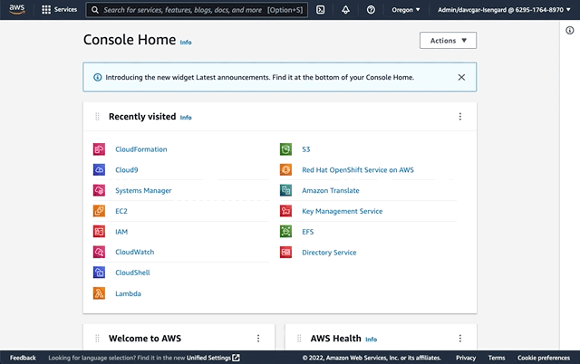
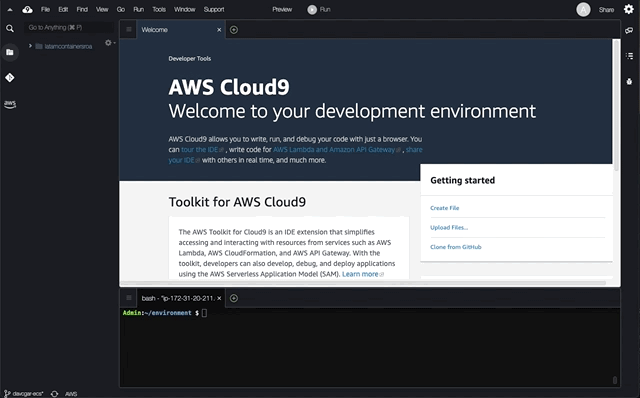

# LATAM Containers Roadshow - Workshop de Amazon ECS

[**< Voltar**](./README_ptBR.md)

## Capítulo 1 - Preparar o Ambiente de Trabalho

Antes da gente começar a meter a mão na massa e explorar o Amazon Elastic Container Service (ECS), precisamos preparar o nosso ambiente de trabalho. Nesse workshop vamos usar o AWS Cloud9 para executar as atividades, que fornece um ambiente integrado de desenvolvimento para escrever, executar e depurar código usando apenas um navegador. Esse ambiente já foi provisionado através de uma automação feita pelo Amazon CloudFormation (código disponível em `helpers/cloudformation-cloud9-template.yaml`), um serviço de infraestrutura como código (IaC) que permite facilmente modelar, provisionar e gerenciar recursos da AWS.

Entretanto, precisamos realizar uma pequena modificação que não foi possível automatizar:

1. Seguindo os passos descritos inicialmente aqui no repositório, vamos acessar a console do seviço AWS Cloud9 e abrir o nosso ambiente chamado `latamcontainersroadshow`:



2. Vamos garantir que estamos usando a funcionalidade de credenciais temporárias do AWS Cloud9 para não precisar gerenciar credenciais manualmente, dado que o AWS Copilot não utilizar EC2 Instance Profiles:



3. Dentro do ambiente AWS Cloud9, vamos criar um arquivo de configuração para o AWS CLI v2:

```bash
cat <<EOF > ~/.aws/config
[default]
region=$(curl -s http://169.254.169.254/latest/dynamic/instance-identity/document | jq .region -r)
output=json
EOF
```

Isso é tudo! Vamos começar a criar nosso ambiente do Amazon ECS com a CLI do AWS Copilot.

[**Próximo >**](./2-Build.md)

<details>
<summary style="font-size:14px">Opcional - Como instalar prerequisitos?</summary>
<br/>

Se você estiver disposto a executar as etapas em sua própria máquina, precisará executar todas as próximas etapas para garantir que tenhamos todas as ferramentas necessárias para os exercícios.

1. Primeiro, vamos nos certificar de que estamos executando os pacotes de sistema mais recentes e temos as dependências mínimas instaladas. Se você estiver executando uma distribuição Linux baseada em RHEL/AL2, precisará executar:

```bash
sudo yum update -y
sudo yum install -y vim git jq bash-completion moreutils gettext yum-utils
```

2. Além disso, precisamos garantir que a versão 2 mais recente da AWS Command Line Interface (CLI) esteja disponível:

```bash
cd ~/environment
curl "https://awscli.amazonaws.com/awscli-exe-linux-x86_64.zip" -o "awscliv2.zip"
unzip awscliv2.zip
sudo ./aws/install --update
rm -rf aws awscliv2.zip
aws --version
```

3. Depois de instalado, você precisa configurar corretamente sua AWS CLI com as credenciais adequadas para a conta da AWS de destino. Essa credencial vai estar atrelada à um IAM User já previamente criado, e que tenha uma IAM Policy adequada (acompanhar [aws/copilot-cli#1345](https://github.com/aws/copilot-cli/issues/1345)).

```bash
aws configure
```

4. Em seguida, vamos instalar a versão mais recente da CLI do AWS Copilot e habilitar o preenchimento automático do bash:

```bash
cd ~/environment
curl -Lo copilot https://github.com/aws/copilot-cli/releases/latest/download/copilot-linux
chmod +x copilot
sudo mv copilot /usr/local/bin/copilot
sudo sh -c '/usr/local/bin/copilot completion bash > /etc/bash_completion.d/copilot'
copilot --version
```
</details>